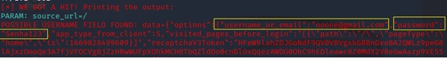

# Phishing for Pinterest password capture

### Tools

* Kali Linux
* setoolkit

### Configuring Phishing in Kali Linux

* Access to root: `sudo su`
* Initializing setoolkit: `setoolkit`
* Kind of attack: `1) Social-Engineering Attack`
* Attack vector: `2) Website Attack Vectors`
* Attack method: `3) Credential Harvester`
* Attack method: `2) Site Cloner`
* URL to clone: http://www.pinterest.com

### Results

