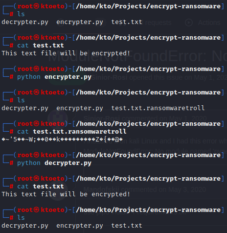

# Creating Ransomware with Python

### Tools

* Kali Linux

### How to use

* Running the code: `python encrypter.py`
* Checking encryption: `cat test.txt.ransomwaretroll`
* Running the decryption: `python decrypter.py`
* Checking decryption: `cat test.txt`

### Results

